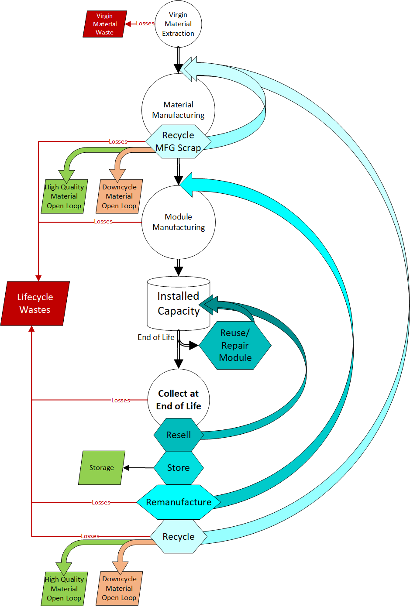

<table>
<tr>
  <td>Version</td>
  <td>
  
</td>
</tr>

<tr>
  <td>License</td>
  <td>
    
</td>
</tr>
<tr>
  <td>Documentation</td>
  <td>
	
  </td>
</tr>
<tr>
  <td>Publications</td>
  <td>
    <!--- <a href="https://doi.org/10.5281/zenodo.3762635">
    
     ---> Connected to Zenodo, awaiting first release
    </a>
  </td>
</tr>
</table>

# PV ICE: PV in the Circular Economy, a Dynamic Energy and Materials TOOL

This open-source tool explores the effects of Circular Economy (CE) pathways for photovoltaic (PV) materials. It can be used to quantify and assign a value framework to CE efforts including re-design, reduction, replacement, reuse, recycling, and lifetime and reliability improvements across the PV value chain. PV ICE enables tradeoff analysis through scenario comparisons, and is highly customizable through user inputs such as deployment schedules, module properties and component materials, and CE pathways.

The provided PV ICE module and material baselines leverage published data from many sources on PV manufacturing and predicted technological changes. Input data are being compiled [here](https://docs.google.com/spreadsheets/d/1WV54lNAdA2uP6a0g5wMOOE9bu8nbwvnQDgLj3GuGojE/edit?usp=sharing) and the baselines are available here for use in other projects as well as for the PV ICE tool.

How it Works
=============

This section provides a brief description of how the PV ICE tool works. Full documentation can be found at [readthedocs](http://CircularEconomy-MassFlowCalculator.readthedocs.io/en/latest/).

Mass
-----

PV ICE is a dynamic mass flow based tool. It takes in any deployment forecast of any evolving module design along with it's component materials and uses sophisticated lifetime and reliability parameters to calculate effective capacity, virgin material demand, and life cycle wastes. The calculator captures all the mass flows shown in the simplified diagram below for all years studied in a simulation (ex: 2020-2050). 

Annually deployed cohorts of modules are tracked through the simulation, subjected to lifetime, degradation, and reliability parameters, and guided along user defined CE pathways (ex: resell, recycling). The PV ICE framework is designed for scenario comparisons (ex: different deployment schedules, module designs, or circular pathways) and is capable of both geospatial and temporal analysis (i.e. when and where materials will be demanded or are available).

Module and material properties are known to be variable with time, and PV ICE can capture this dynamic evolution of PV technology. Dynamic baseline inputs for crystalline silicon PV modules and component materials are provided in the PV_ICE \ baselines folder. These baselines are dervied from [literature and report data](https://docs.google.com/spreadsheets/d/1WV54lNAdA2uP6a0g5wMOOE9bu8nbwvnQDgLj3GuGojE/edit?usp=sharing). Module baselines capture the annual average crystalline silicon module (i.e. a market share weighted average of the silicon PV technologies deployed). Each material similarly is a market share weighted average of silicon PV technologies, compiled from multiple sources, most notably consistent with ITRPV data. Please see the Jupyter Journals (tutorials \ baseline development documentation) for the derivations and sources (baselines \ SupportingMaterials) of the provided c-Si baselines. Alternate module and material files can be created by the user, and an expanded set of PV technology baselines is planned for the future, including CdTe and perovskites.

Energy
-------

The energy balance of renewable energy technologies is as important and the mass balance when evaluating sustainability. Additionally, few studies of Circular Economy (CE) pathways consider the energy return on investment of a particular pathway. PV ICE energy flows fill this analysis gap, and provide useful insights into the potential tradeoffs between mass and energy of CE pathways.

The energy flows of PV ICE are based on the mass flows. These energy flows, like the mass flows, are dynamic with time and are seperated into module and material energies. For each supply chain process step captured in the mass flows, an energy per module area or energy per material mass is captured as an input (ex: module manufacturing energy, energy to manufacture rolled glass from silica sand, energy to crush a module for recycling ). The energy demanded for each step is the sum of all electrical energy demands and all fuel/heating energy demands. 

We provide an energy baseline for crystalline silicon modules and component materials. Data for these baselines is being compiled from [literature and report data](https://docs.google.com/spreadsheets/d/1WV54lNAdA2uP6a0g5wMOOE9bu8nbwvnQDgLj3GuGojE/edit?usp=sharing). For the complete derivation of the energy demands for crystalline silicon modules and materials, please see the Jupyter Journals (tutorials \ baseline development documentation) and (baselines \ SupportingMaterials). Alternate module and material files can be created by the user, and an expanded set of PV technology baselines is planned for the future, including CdTe and perovskites.

After running a mass flow simulation, an energy flow calculation can be run which will multiply the energy demands by the mass flows and calculate annual generation from the deployed modules. Results of this calculation provide annual, cumulative, and lifetime energy demands and energy generated. These values can be used to calculate energy balance metrics such as energy return on investment (EROI), net energy, and energy payback time (EPBT). These features are actively under development, so check back for updates soon!

Installation for PV ICE
=======================

PV ICE releases may be installed using the ``pip`` and ``conda`` tools.
Please see the [Installation page](http://PV_ICE.readthedocs.io/en/latest/installation.html) of the documentation for complete instructions.

PV ICE is compatible with Python 3.5 and above.

Install with:

    pip install PV_ICE

For developer installation, download the repository, navigate to the folder location and install as:

    pip install -e .

How to Get Started
===================

After you have installed PV ICE, we recommend heading over to our tutorials jupyter journals (PV ICE \ docs \ tutorials). There you will find journals ["0 - quick start Example"](https://github.com/NREL/PV_ICE/blob/development/docs/tutorials/0%20-%20quickStart%20Example.ipynb) and ["1 - Beginner Example"](https://github.com/NREL/PV_ICE/blob/development/docs/tutorials/1%20-%20Beginner%20Example.ipynb) which can help guide you through your first simulation using the PV ICE provided crystalline silicon PV baselines. In journals 2-4 we walk you through modifications to the basic simulation, including modifying parameters with PV ICE functions to suit your analysis needs.

Some Analyses Featuring/Leveraging PV ICE
==========================================

PV ICE has been used in a variety of published analyses, including:

The Solar Futures Report and Circular Economy Technical Report

Ardani, Kristen, Paul Denholm, Trieu Mai, Robert Margolis, Eric O’Shaughnessy, Timothy Silverman, and Jarett Zuboy. 2021. “Solar Futures Study.” EERE DOE. https://www.energy.gov/eere/solar/solar-futures-study.

Heath, Garvin, Dwarakanath Ravikumar, Silvana Ovaitt, Leroy Walston, Taylor Curtis, Dev Millstein, Heather Mirletz, Heidi Hartman, and James McCall. 2022. “Environmental and Circular Economy Implications of Solar Energy in a Decarbonized U.S. Grid.” NREL/TP-6A20-80818. NREL.

ISCIENCE

Ovaitt & Mirletz, Silvana & Heather, Sridhar Seetharaman, and Teresa Barnes. 2022. “PV in the Circular Economy, A Dynamic Framework Analyzing Technology Evolution and Reliability Impacts.” ISCIENCE, January. https://doi.org/10.1016/j.isci.2021.103488.

PVSC

Mirletz, Heather M, Silvana Ovaitt, Ashley Gaulding, Seetharaman Sridhar, and Teresa Barnes. 2022. “Quantifying Energy Flows in PV Circularity Processes.” In , 3. Philidelphia PA.

PVRW

Mirletz, Heather, Silvana Ovaitt, and Teresa M. Barnes. 2022. “Short-Lived Modules Need to Be Efficient, Lightweight, and Circular for the Energy Transition.” In PVRW 2022. online: NREL.

Contributing
============

We need your help to make PV ICE a great tool!
Please see the [Contributing page](http://PV_ICE.readthedocs.io/en/stable/contributing.html) for more on how you can contribute.
The long-term success of PV ICE requires substantial community support.

License
=======

BSD 3-clause

Getting support
===============

If you suspect that you may have discovered a bug or if you'd like to
change something about CF-MFA, then please make an issue on our
[GitHub issues page](https://github.com/NREL/PV_ICe/issues).

Citing
======

If you use PV_ICE in a published work, please cite:

	Ayala Pelaez, Silvana; Mirletz, Heather; Silverman, Timothy; 
	Carpenter, Alberta; Barnes, Teresa. “De-fluffing Circular 
	Economy Metrics with Open-Source Calculator for PV” 
	2020 PV Reliability Workshop, Denver CO.

and also please also cite the DOI corresponding to the specific version of
PV ICE that you used. PV ICE DOIs are listed at
[Zenodo.org](https://zenodo.org/). For example for version 0.2.0:

	Silvana Ayala, Heather Mirletz, & Acadia Hegedus. (2021). 
	NREL/PV_ICE: Release version 2 (v0.2.0). Zenodo. 
	https://doi.org/10.5281/zenodo.5196342
