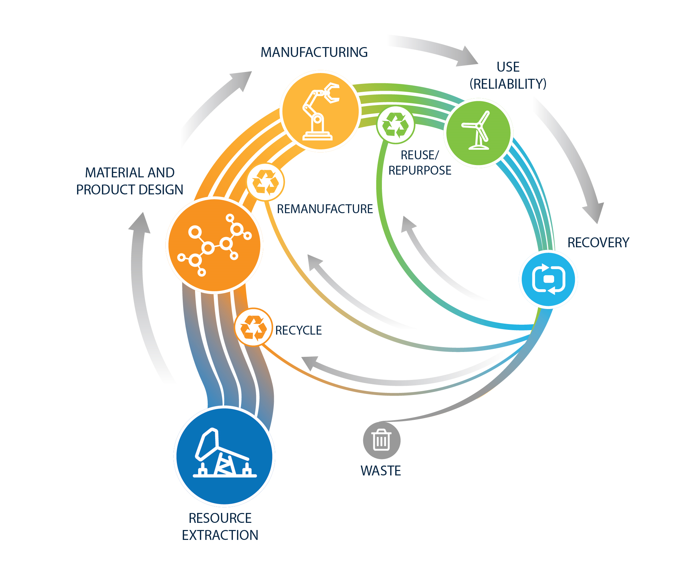
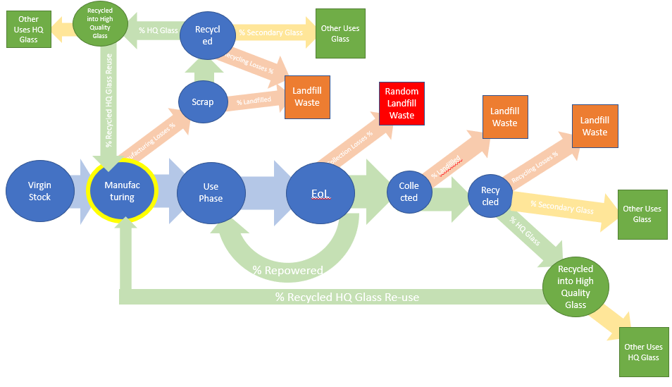

<table>
<tr>
  <td>License</td>
  <td>
    
</td>
</tr>
<tr>
  <td>Build Status</td>
  <td>
    
  </td>
</tr>
<tr>
  <td>Publications</td>
  <td>
    <!--- <a href="https://doi.org/10.5281/zenodo.3762635">
    
     ---> Connected to Zenodo, awaiting first release
    </a>
  </td>
</tr>
</table>

# CEMFC: Circular Economy - Mass Flow Calculator

This open-source tool will help quantify and assign a value framework to efforts on re-design, reduction, replacement, reusage, recycling, and lifetime and reliability increases on PV, implementing Circular Economy metrics for PV materials.

The CE-MFC is leveraging published data from different sources on PV manufacturing and predicted technological changes. Input data is being compiled [here](https://docs.google.com/spreadsheets/d/1WV54lNAdA2uP6a0g5wMOOE9bu8nbwvnQDgLj3GuGojE/edit?usp=sharing)

This tool will help implement circularity metrics, quantify and assign a value framework to efforts on re-design, reduction, replacement, reusage, recycling, and lifetime and reliability increases on PV.

Documentation
=============

The calculator follows the following diagram for calculating Mass Flow. Baseline inputs are available in the CEMFC \ baselines folder for US and World past and projected values. Full documentation can be found at [readthedocs](http://CircularEconomy-MassFlowCalculator.readthedocs.io/en/stable/).

Installation
============

CircularEconomy-MassFlowCalculator releases may be installed using the ``pip`` and ``conda`` tools.
Please see the [Installation page](http://CircularEconomy-MassFlowCalculator.readthedocs.io/en/stable/installation.html) of the documentation for complete instructions.

CircularEconomy-MassFlowCalculator is compatible with Python 3.5 and above.

Contributing
============

We need your help to make CE-MFC a great tool!
Please see the [Contributing page](http://CircularEconomy-MassFlowCalculator.readthedocs.io/en/stable/contributing.html) for more on how you can contribute.
The long-term success of CircularEconomy-MassFlowCalculator requires substantial community support.

License
=======

BSD 3-clause

Getting support
===============

If you suspect that you may have discovered a bug or if you'd like to
change something about CF-MFA, then please make an issue on our
[GitHub issues page](https://github.com/NREL/CircularEconomy-MassFlowCalculator/issues).

Citing
======

If you use CF-MFA in a published work, please cite:

	Ayala Pelaez, Silvana; Mirletz, Heather; Silverman, Timothy; 
	Carpenter, Alberta; Barnes, Teresa. “De-fluffing Circular 
	Economy Metrics with Open-Source Calculator for PV” 
	2020 PV Reliability Workshop, Denver CO.

Please also cite the DOI corresponding to the specific version of
CF-MFA that you used. CF-MFA DOIs are listed at
[Zenodo.org](https://zenodo.org/)

