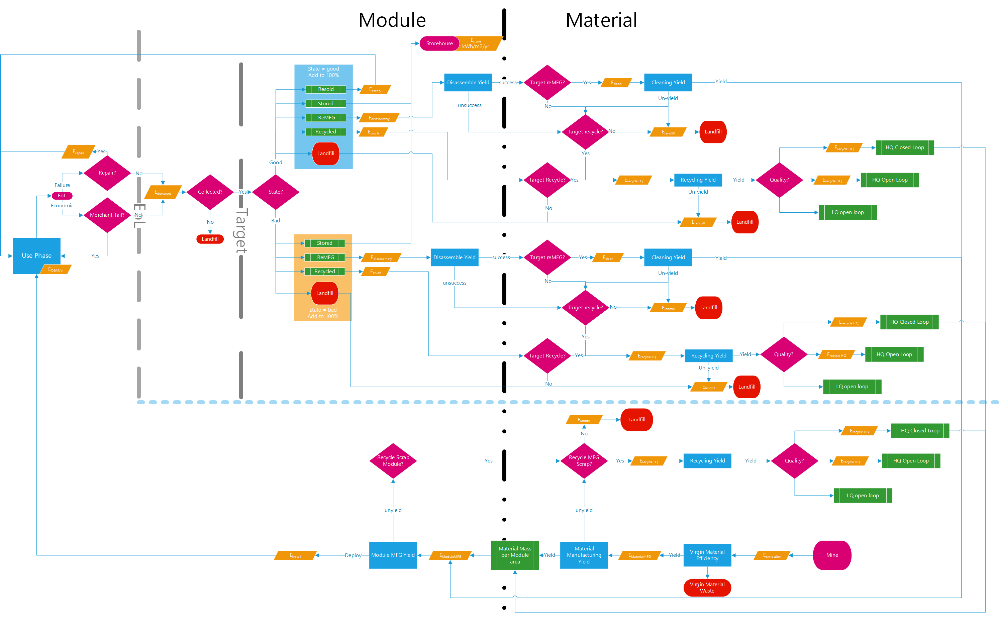
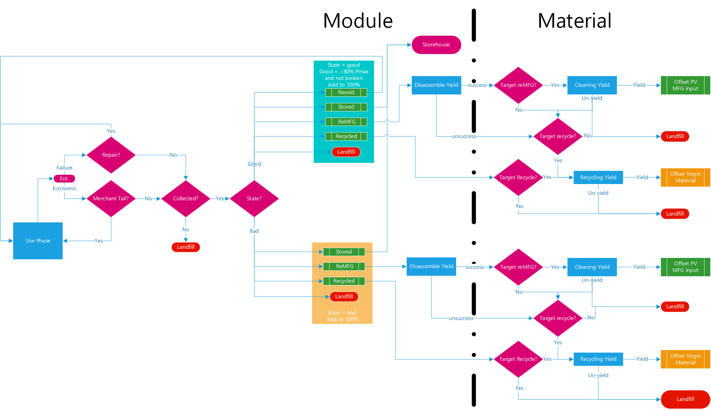

.. _package_overview:

Package Overview
================

In addition to the documentation here, please check out our paper documenting the development and use of the PV ICE tool!
        S. Ovaitt & H. Mirletz, S. Seetharaman, and T. Barnes, 
        “PV in the Circular Economy, A Dynamic Framework Analyzing 
        Technology Evolution and Reliability Impacts,” ISCIENCE, Jan. 2022,
        doi: https://doi.org/10.1016/j.isci.2021.103488.

The PV ICE tool explores the effects of Circular Economy (CE) pathways for photovoltaic (PV) materials. It can be used to quantify and assign a value framework to CE efforts including re-design, lightweighting, replacement, reuse, recycling, and lifetime and reliability improvements across the PV value chain. PV ICE enables tradeoff analysis through scenario comparisons, and is highly customizable through user inputs such as deployment schedules, module properties and component materials, and CE pathways. The PV ICE tool considers the following material flows and their associated energies:

.. image:: ../../images_wiki/PV_ICE_diagram-simpleAltUpdate.png
  :width: 450
  :alt: Simplified diagram of mass flows captured in the PV ICE tool.

PV ICE system boundaries include “Virgin Extraction & Refinement,” “PV Manufacturing,”  “Use Phase,” and “End-of-Life,”. Mass flows (arrows) are affected by process efficiencies (circles) and decision points (hexagons). Mass flows are split into module and material properties. All materials are tracked on a mass-per-module-area basis, allowing conversion between module and material. The module and its materials can follow a linear flow from extraction to EoL in the landfill, or follow circular pathways (teal arrows). Process efficiencies or yields (circles) dictate extra material demands and wastes generated in a process step (ex: kerf loss of silicon). Decision points (hexagons) are influenced by stakeholders or policy decisions and regulations, dictating the fraction of modules or materials which follow a specific pathway (ex: fraction of modules recycled at EoL).

Calculations of mass and energy are driven by annual installed capacity. The input deployment schedule and module efficiency are used to calculate the area of new deployed capacity. The material demand is determined from this deployed area because materials are tracked on a per module area basis. Cohorts of intalled modules (and their associated materials) are installed and are tracked annually for power degradation (ex: 0.5%/year), probability of failure (Weibull), and their economic lifetime (ex: 25 year warranty).  As modules enter end of life (EOL) through any of the 3 EOL criteria, a collection rate is applied, and they are first evaluated for "good status" or "bad status". Based on their good/bad status, different EOL pathways are available, including landfill, reuse, remanufacture and recycling. Inputs determine the fraction of modules entering circular EOL pathways, which can be used to offset virgin material demand for the upcoming cohort of deployment. All properties/inputs are dynamic with time to account for PV module technology evolution and changing business practice and policy landscape.

Inputs to the calculator are csvs with the columns corresponding to mass and energy quantities and pathway determinations. In addition to the PV ICE framework, we provide module and material baselines of the average crystalline silicon PV module over time, accounting for technology evolution.  Baseline input files of module and materials for 1995-2050 are available in the PV_ICE/baselines folder.

Framework and Definitions
----------------------------

The following flow chart details the mass and energy path structure of the PV ICE framework.

Material Extraction, PV Manufacturing & Use Phase
~~~~~~~~~~~~~~~~~~~~~~~~~~~~~~~~~~~~~~~~~~~~~~~~~~~~
Mining/extraction and refinement/processing of the virgin materials are represented as a single efficiency for each material ("Virgin Material Efficiency") capturing the order of magnitude of material extraction yield. Next, "Manufacturing" converts a mass of processed materials into an area of module. Yields for both material use and module manufacturing are considered. Recycling pathways are available for manufacturing scrap and mimic the EOL recycling pathways described below. "Lifetime/UsePhase" installs the module and generates electricity over it's lifetime, accounting for expected power degradation. 

EOL
~~~~~
Modules reach End of Life in one of three forms: economic/warranty lifetime, power degradation, or probabilistic failure. All functions are applied to each annual cohort of modules. 

Economic/Warranty Lifetime
^^^^^^^^^^^^^^^^^^^^^^^^^^^^^^
This annual module property reflects the market trends of PV system lifetime. The PV module is the longest lived component of a PV system. Typically, the PV system has an economic pay back period, loan term, or PPA, while the PV module has a warranty period (ex: 25 years). This input allows for a PV system to reach EOL throuh non-technical determination. The economic EOL mode has the potential for the Merchant Tail EOL pathway.

Degradation
^^^^^^^^^^^^^
Modules have an expected degradation from their nameplate capacity each year (ex: 0.5%/year), producing less power over time. Once the nameplate capacity is reduced below a certain threshold (ex: 80% of nameplate), then modules are deemed to be at EOL. 

Failure
^^^^^^^^^
All products have a probability of failure. Failure is a random occurrence where the module stops working on site at any point after installation. Early loss of modules are due to manufacturing defects, low quality components, or installation errors and usually represent a higher amount of failures in the first 4 years of deployment. Failure probability also increases as the modules get near their end of lifetime.

Weibull distributions are commonly used in product reliability to capture lifetime and failure occurrences. We are controlling our weibull curve parameters by using the T50 and T90 values, which represent the time at which 50% and 90% of the cohort has failed, respectively. For PV panels that are expected to last past their 30 year warranty, T50 and T90 must be bigger than 30, for example T50=35 years and T90=40 years. PV ICE can calculate and print out the "alpha" and "beta" Weibull shape values corresponding to the T50 and T90 values as required.

The failure EOL mode has the potential for the "Repair" EOL pathway.

EOL Pathway Options
~~~~~~~~~~~~~~~~~~~~~
Each year in the model produces modules that enter EOL. Below is a flow chart of the EOL decision tree.

First, there are two pathways before demounting the module which depend on EOL mode (as described above).

Repair 
^^^^^^^^
(Failure only, before collection) A module is at EOL (through failure) and an onsite fix to the module defect or problem is possible such that the module is not demounted. If the module is not repaired, it is assumed to be at End of Life and goes through collection.

Merchant Tail
^^^^^^^^^^^^^^
(Economic only, before collection) Merchant tail is an industry practice where the system is left inplace after the loan or PPA has ended. It's called merchant tail because typically this is a bump in revenue for the system. If the module is used for merchant tail, then it is returned to use phase/generating capacity and will continue to degrade and fail at cohort determined rates.

If the module doesn't undergo repair or merchant tail, then it is demounted and an EOL module collection is considered. A collection efficiency/rate of modules is applied - any non-collected modules are landfilled (this is representative of ~2020 industry practice). 

Next, EOL modules are checked for quality, which determines available EOL paths.

* Status = Good: Module is at > 80% of nameplate power and did not reach EOL through Failure
* Status = Bad: Module is at < 80% of nameplate power and/or reached EOL through Failure

A summary of the EOL path options, requirements, and corresponding variables is found in the table below.

.. csv-table:: EOL Pathway Options
  :file: ../../images_wiki/EOLPaths.csv
  :widths: 10,10,40,40
  :header-rows: 1

0. Resell
^^^^^^^^^^^
The module is demounted, undergoes recertification testing, and is sold on the secondary market. The module is returned to the use phase at it's cohort determined degraded power and continues generating power. It will re-enter EOL again later.

1. Landfill
^^^^^^^^^^^^
(optional) Module materials are landfilled. This variable will be adjusted to accommodate the fractions of other pathways.

2. Store
^^^^^^^^^^
(BETA) The module is demounted and warehoused.

3. Remanufacture
^^^^^^^^^^^^^^^^^
The module is demounted and sent through a dissassembly process with the goal of recovering material components intact (ex: front glass). There is a yield associated with the module dissassembly process and seperate material cleaning process. Whether or not a material is a target of remanufacture is determined in the material properties.

4. Recycle
^^^^^^^^^^^^
The module is demounted and sent through a dissassembly and/or crushing process with the goal of recovering constituent materials. These materials undergo individual recycling processes (with associated yields). The recycled materials are recovered at low purity and used in other industries ( down-cycled, open-loop), at high purity and used in other industries (HQ open-loop), or at high purity and used in the manufacture of new PV modules offsetting virgin material demand (HQ closed-loop). 

There is an analogous recycling loop for manufacturing material scrap. 

Functions and Features
-----------------------
This section documents the functions included in the PV ICE tool.

Mass Simulation 
~~~~~~~~~~~~~~~~
The dynamic mass flow simulation is the basis of the PV ICE tool. These functions are associate with creating and setting up a mass flow simulation. For a more complete tutorial, see the `jupyter journal tutorials <:ghuser:NREL/PV_ICE/docs/tutorials>`_

Create Scenario
^^^^^^^^^^^^^^^^
``sim1.createScenario(name, file)``

This is used after creating a simulation object, it creates a scenario within the simulation object. Multiple scenarios can (and probably should) be stored in the same simulation - this allows for scenario comparison. The function takes in a scenario name and a module file. See Data: Mass/Module Input File for details on the required input file.

Add Material
^^^^^^^^^^^^^
``sim1.scenario['scenname'].addmaterial(materialname, file)``

After creating a scenario, this function adds materials to the scenario. Different scenarios can have different materials, and the inputs can be dynamic. The function takes in a material name, and a material file. See Data: Mass/Material Input File for details on the required input file.

Calculate Mass Flow
^^^^^^^^^^^^^^^^^^^^^
``sim1.calculateMassFlow()``

``sim1.calculateMassFlow(scenarios, materials, weibullInputParams, bifacialityfactors, reducecapacity)``

This is the major function of PV ICE. Once you have set up the scenario(s) with materials, calculate mass flow can be run. There are optional arguments which can be given to the function. This function returns a dataframe of the module and material baselines with added calculation columns. The calculation cycles over each year of the scenario (year column), calculating mass flows of each material and module area. Quantities of mass and area in each lifecycle stage are summed annually. 

Modify Scenarios and Materials functions
~~~~~~~~~~~~~~~~~~~~~~~~~~~~~~~~~~~~~~~~~~~
The following set of functions are used to improve the ability of the user to customize and tweak scenarios. 

Modify Scenario
^^^^^^^^^^^^^^^^^
``sim1.modifyScenario(scenarios, stage, value, startyear)``

This versitile function allows the user to modify any module input variable in any scenario to a new value or set of values starting in a particular year. Dynamic inputs are enabled. Note, this function changes module input variables. To modify material input variables, see modifyMaterials below.

IRENA-ify
^^^^^^^^^^^
``sim1.scenMod_IRENIFY(scenarios, ELorRL)``

This function modifies to the target scenario(s) to match the lifetime, reliability and manufacturing inputs of the IRENA 2016 End of Life Report parameters. This function takes in scenario(s) name(s) and "EL" or "RL". The function modifies the target scenario(s) Weibull parameters to match the IRENA 2016 "Early Loss" or "Regular Loss" alpha and beta parameters. Additionally, the function sets the module economic lifetime to 40 years and sets the module and material manufacturing efficiencies/yields to 100%. 

Trim Years
^^^^^^^^^^^
``sim1.trim_Years(scenarios, materials, startYear, endYear, aggregateInstalls=T/F, averageEfficiency=T/F, averageMaterialData = T/F, methodAddedYears='repeat/zeroes')``

This function takes in scenario(s) and material(s), a start and end year and trims the inputs to consider a different set of years. If a startYear/endYear is not provided, the function will use the module data year parameter to set the time period. If aggregateInstalls=T, for any trimmed years, the new_Installed_Capacity_[MW] will be summed and used as the first year of installs. If averageEfficiency=T, the function will take the mean of the module efficiency during the trimmed years and use it as the first year average module efficiency.

NOTE: Add years function is NOT yet complete. MethodAddedYears provides two options for populating data into the added years; repeating the last year of data or filling all values with 0. To change it to a user input, use modifyScenario function above.

Perfect Manufacturing
^^^^^^^^^^^^^^^^^^^^^^^^
``sim1.scenMod_PerfectManufacturing(scenarios)``

This function takes in scenario(s) and sets all module and material manufacturing variables (``mod_MFG_eff``, ``mat_virgin_eff``, ``mat_MFG_eff``) to be 100% yield/efficiency. 

No Circularity
^^^^^^^^^^^^^^^
``sim1.scenMod_noCircularity(scenarios)``

This function takes in scenario(s) and sets all circular pathways to 0.0 for both the module and material inputs. This changes the scenario to a linear economy.

Modify Materials
^^^^^^^^^^^^^^^^^^
``sim1.scenario['scenname'].modifyMaterials(materials, stage, value, start_year)``

This function takes in material(s), variable name(s), new value(s) and a start year to modify a variable in the material input. Dynamic inputs are enabled for all function arguments. This function is the material version of Modify Scenario above. Note, this function does not modify module input variables.

Results and Plotting
~~~~~~~~~~~~~~~~~~~~~
The following functions are used to process the results of running ``calculateMassFlow()``.

Aggregate Results
^^^^^^^^^^^^^^^^^^
``yearly, cumulative = sim1.aggregateResults()``

This function returns two dataframes; yearly or annual mass flow results and cumulative mass flow results for each year of the simulation. The dataframes include the most commonly sought results; virgin material demand, manufacturing scrap, EOL waste, and life cycle wastes (sum of manufacturing scrap and EOL) of all materials and summed as module mass, as well as newly installed capacity, and the effective capacity. 

Effective Capacity is defined by the PV ICE tool as the sum of all new installs, minus degradation, failures/EOL, plus repairs/MerchantTail/Resold modules. Effective Capacity represents the real generating capability of installed modules. Effective capacity is inherently cumulative and will always be less than cumulative nameplate installed capacity.

Plot Scenarios Comparison
^^^^^^^^^^^^^^^^^^^^^^^^^^^
``sim1.plotScenariosComparison(keyword, scenarios)``

This function takes in a variable keyword and scenario(s) and returns a plot of the variable over time for all specified scenarios. This provides a fast way to examine results of your simulation. 

Plot Mass Metric Results
^^^^^^^^^^^^^^^^^^^^^^^^
``sim1.plotMetricResults()``

This function combines the next two functions (plot material results and plot installed capacity results), returning annual and cumulative plots of all mass flows, and a plot of the effective capacity over time for all scenarios.

Plot Material Results
^^^^^^^^^^^^^^^^^^^^^^^
``sim1.plotMaterialResults(keyword, yearlyorcumulative='yearly/cumulative', cumplot=T/F)``

This function takes in a variable keyword, yearly or cumualtive, and . The keyword options are ``'VirginStock', 'WasteALL', 'WasteEOL', 'WasteMFG'``. 

Plot Installed capacity results
^^^^^^^^^^^^^^^^^^^^^^^^^^^^^^^^^
``sim1.plotInstalledCapacityResults(cumplot=T/F)``

This function plots the effective capacity and the new_Installed_Capacity. The plot can be done on an annual or cumualtive basis. 

Energy Calculations
~~~~~~~~~~~~~~~~~~~~~~
The following functions calculate the energy flows and process the results of these calculations. Energy flow calculations must be run AFTER a mass flow calculation, as the energy flows are calculated on a per mass or per module area basis.

Calculate Energy Flow
^^^^^^^^^^^^^^^^^^^^^^^
``de, de_cum = sim1.calculateEnergyFlow(scenarios, materials, modEnergy, matEnergy, insolation=4800, PR=0.85)``

This function performs the energy flows calculation. It takes in scenarios and materials for the calculation to be performed on. It requires and modEnergy and matEnergy input file - for the details of these input files, please refer to **Data: Energy**. The function also has an optional insolation quantity and a performance ratio for calculating energy generated. 

The function returns two data frames, an annual and a cumulative energy demand by lifecycle stage and energy generation.

NOTE: this function is under active development, check back for updates soon!

Transportation and Distance
^^^^^^^^^^^^^^^^^^^^^^^^^^^^^
``sim1.distance(s_lat, s_lng, e_lat, e_lng)``

This function takes in a start and end latitude and longitude and calculates the as the crow flies distance between the two points accounting for earths curvature. The function returns a float value distance in km.

``sim1.drivingdistance(origin, destination, APIkey)``

This function takes in two arrays of latitude and longitude for an origin and a destination, and an API key. The function creates an API call to google maps to obtain the driving directions between two points. The function returns a google maps url.