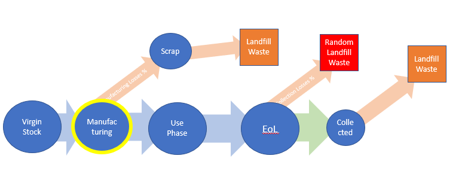

.. _package_overview:

Package Overview
================

The calculator considers the following material flow:

.. image:: ../../images_wiki/MFC-Diagram.PNG
  :width: 450

The starting point is the installed capacity. From there, the percentage of probability of each arrow determines the amount of material on each stage. For example, if 20% gets Recycled, that means the other 80% goes to landfill.

Input to the calculator is an excel file with the appropriate columns to establish all the paths in the diagram. Examples for baseline input files for the US and World past and projected values are available in the CEMFC/baselines folder.

For contrast, a completely linear economy would look like:

Input Data
----------------
At least two files of baselines are needed for the simulation: 1) one file with module parameters throughout the years, for example *baseline_US*, and 2) one or more files with process parameters for each material being analyzed in the module, for example *baseline_glass*. See **baseline_module** and **baseline_material** for more details on input columns needed and their definition. 

The baselines folder in the CEMFC provides baseline scenarios for modules in the US and World level, as well as baseline_materials for glass, Silver and Aluminum. For more details on the source of these values, see the documentation on baselines. 

baseline_module
==============
year : int
Year. 

new_Installed_Capacity_[MW]: float
New installed PV capacity in MW. Additions of PV modules in nameplate MW peak in the specified year.

module_efficiency_[%]: float 
Nameplate efficiency of the module. i.e.: 22.3 %.

module_reliability_t50_[years]: float
(optional) The number of years after the installation year at which 50% of the cohort of  modules will be removed from the field

module_reliability_t90_[years]: float
(optional) The number of years after the installation year at which 90% of the cohort of  modules will be removed from the field

module_degradation_[%]: float
Percentage annual reduction of the module’s performance, relative to it’s nameplate. i.e. 0.5 %. 

*module_manufacturing_efficiency_[%]: float
Efficiency of manufacturing modules (if there are losses of modules and all associated   products during production). 

*module_EOL_collection_losses_[%]: float
Percentage of modules collected from the field at end of life for sorting and disposition. i.e. 30%

module_EOL_collected_recycled_[%] : float
Percentage of collected end of life modules that are sent to recycling

*module_repowering_[%]: float
Percentage of modules at EOL from degradation that are repowered.

*module_repairing_[%]: float
Percentage of modules at EOL from failure that are repaired and go back to functioning  in the field.

baseline_material
==============

*material_virgin_efficiency_[%]: float
Efficiency of mining, extracting, and purifying the material up to the point of entry into the module manufacturing line. 

*material_masspermodule_[kg]: float
Mass of specified material in kilograms per PV module

material_manufacturing_efficiency_[%]: float
Efficiency of the manufacturing production line for the material - i.e. how much of the input material is incorporated into the module

material_manufacturing_scrap_recycled_[%]: float
The percentage of the scrap generated at the manufacturing facility that is sent to recycling (internal or external).

material_manufacturing_scrap_recycling_efficiency_[%]: float
Efficiency of the scrap recycling process

material_manufacturing_scrap_recycled_into_HighQuality_[%]: float
Percentage of manufacturing scrap which is recycled into high quality material and used for non-PV module applications externally (open loop)

material_manufacturing_scrap_recycled_into_HighQuality_reused_for_module_manufacturing_[%]: float
Percentage of manufacturing scrap material which is recycled and used in the manufacturing of a new module

*material_EOL_collected_Recycled_[%]: float
Percentage of collected end of life material which is sent to recycling

material_EOL_Recycling_efficiency_[%]: float
Efficiency of the end of life recycling process, i.e. percentage of the material that is put  through the process that is successfully recycled

EOL_Recycled_Material_into_HighQuality_[%]: float
Percentage of collected end of life material recycled into high quality material and used  for non-PV modules applications externally (open loop)

EOL_Recycled_HighQuality_Reused_for_Manufacturing_[%]: float
Percentage of end of life recycled material that is recycled into high quality material and used in the manufacture of a new module (closed loop)

Output Data
------------------
The CEMFC calculates virgin material, landfilled and recycled materials, and the many other  steps in the Mass Flow Diagram for each year dynamically. It appends these annual results to the dataframe loaded from baseline_module and baseline_materials. A description of the output columns is below.

CEMFC Outputs
============
module_installedCapacity_[MW]
Summation of all cohorts of installed PV actively in the field in the specified year

material_installedMass_[kg]: float
Summation of material associated with the total installed capacity in the field in a specified year

material_EoL_[kg]: ** material_EoL_waste_[kg]:
Material in modules from all cohorts that reach that year the end-of-life stage. This value already reflects repowered, reused, or  re-manufactured modules.

material_EoL_CollectionLost: float
Summation of waste material accounting for collection efficiency on an annual basis

material_EoL_Collected_Recycled: float
Summation of waste material sent for recycling, accounting for collection efficiency  losses

material_EoL_Collected_Landfilled: float
End of life collected material that is landfilled, as opposed to recycled, on an annual basis

material_EoL_Recycled_Succesfully: float
End of life collected material that is successfully recycled, accounting for recycling process efficiencies, on an annual basis.

material_EoL_Recycled_Losses_Landfilled: float
Material waste as output by the recycling process, which is landfilled, on an annual basis.

material_EoL_Recycled_into_HQ: float
Quantity of material which is successfully recycled into high quality material, on an annual basis.

material_EoL_Recycled_into_Secondary: float
Quantity of material recycled into low quality material, i.e. downcycled, on an annual basis.

material_EoL_Recycled_HQ_into_Manufacturing: float
Quantity of material which is successfully recycled into high quality material and is used in closed loop for new PV modules, on an annual basis.

material_EoL_Recycled_HQ_into_OtherUses: float
Quantity of material which is successfully recycled into high quality material and is used in open loop in other applications, on an annual basis.

material_manufacturing_input: float
Quantity of material required to be input to the manufacturing process, accounting for inefficiencies in the production process, on an annual basis.

material_manufacturing_scrap: float
Quantity of scrap material generated during the manufacturing process, on an annual basis.

material_manufacturing_scrap_Recycled: float
Quantity of scrap material from the manufacturing process which is recycled, on an annual basis.

material_manufacturing_scrap_Landfilled: float
Quantity of scrap material generated during the manufacturing process which is not recycled, on an annual basis.

material_manufacturing_Scrap_Recycled_Succesfully: float
Quantity of scrap material generated during the manufacturing process which is successfully recycled, accounting for process efficiencies, on an annual basis.

material_manufacturing_Scrap_Recycled_Losses_Landfilled: float
Quantity of waste material generated and landfilled from the scrap recycling process, on an annual basis.

material_Manufacturing_Recycled_into_HQ: float
Quantity of manufacturing scrap material successfully recycled into high quality material, on an annual basis.

material_Manufacturing_Recycled_into_Secondary: float
Quantity of manufacturing scrap material successfully recycled into low quality material, i.e. downcycled, on an annual basis.

material_Manufacturing_Recycled_HQ_into_Manufacturing: float
Quantity of manufacturing scrap material successfully recycled into high quality material and input to the manufacturing process (closed loop), on an annual basis.

material_Manufacutring_Recycled_HQ_into_OtherUses: float
Quantity of manufacturing scrap material successfully recycled into high quality material and used in external applications (open loop), on an annual basis.

material_virgin_stock: float
Annual quantity of virgin raw material inputs to the manufacturing process to provide for the manufacturing needs. This value compensates for process and efficiency parameters such  as recycled material input.  

material_Total_EoL_Landfilled_Waste: float
Annual quantity of material sent to the landfill from the end of life, including process inefficiencies and collection losses.  

material_Total_Manufacturing_Landfilled_Waste: float
Annual quantity of material sent from the manufacturer to the landfill, including process and internal recycling process inefficiencies.  

material_Total_Landfilled_Waste: float
EoL + Manufacturing. Annual total quantity of material from all processes, manufacturing, recycling, end of life, which are sent to the landfill.  

Total_EoL_Recycled_OtherUses: float
Annual total quantity of material from all processes, manufacturing, recycling, end of life, which are recycled into external applications, open loop.  
